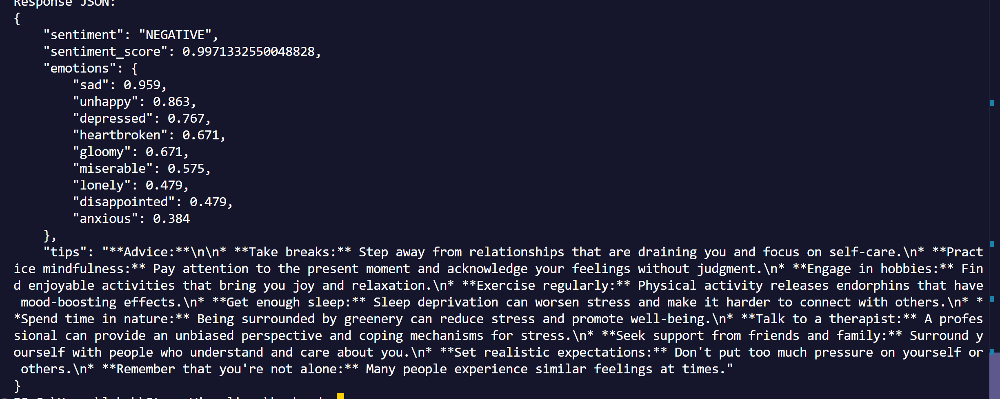
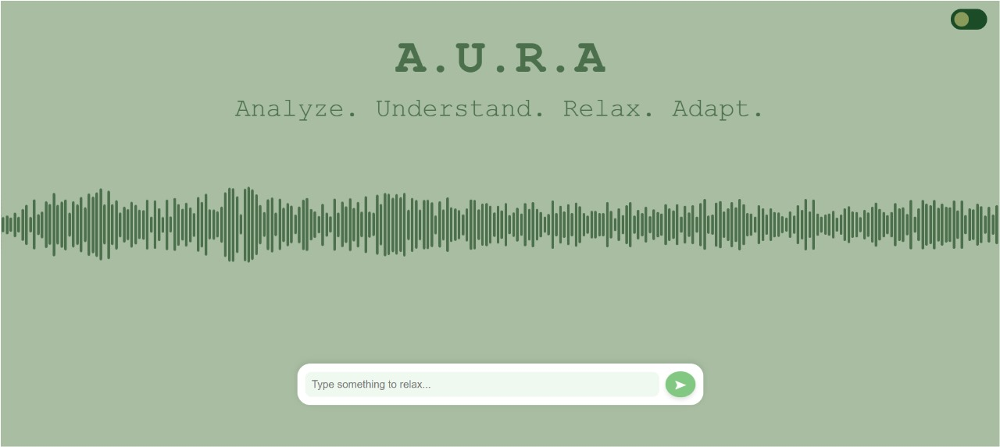
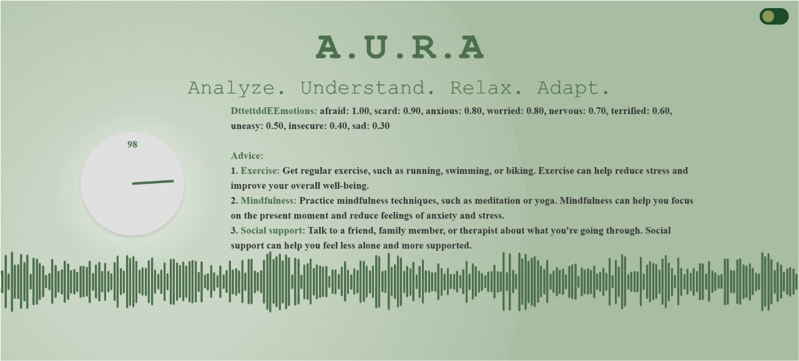

# AURA
Analyze. Understand. Relax. Adapt

## Basic Details

### Team Name: GirlCode

### Team Members
Member 1 : Lana Anvar - DCS, CUSAT 
</br>
Member 2 : S Sutharya - DCS, CUSAT 
</br>
Member 3 : Lakshmikha Rejith - SOE, CUSAT

### Hosted Project Link


### Project Description
AURA is a comprehensive application designed to analyze and visualize the emotional and mental state of users based on their textual input. The application detects emotions, analyzes sentiment, and generates personalized advice to help users manage their stress levels.

### The Problem Statement
In today's fast-paced world, individuals are increasingly experiencing high levels of stress and anxiety due to various personal and professional challenges. Despite the availability of numerous mental health resources, many people struggle to find personalized and immediate support that addresses their unique emotional states. Traditional methods of stress management often fail to provide real-time, tailored advice that can help individuals cope with their specific situations.


### The Solution
The solution is to develop a web application that can accurately analyze a person's emotional and mental state based on their textual input and provide personalized, actionable advice to help them manage their stress levels effectively. This solution leverages advanced natural language processing (NLP) techniques to detect emotions, analyze sentiment, and generate contextually relevant advice, thereby offering a comprehensive and user-friendly tool for mental health support.

## Technical Details

### Technologies/Components Used
Languages Used : Python, JavaScript
</br>
</br>
Frameworks Used : React
</br>
</br>
Libraries Used : 
</br>
Python - FastAPI, Pydantic, Transformers, Torch, Requests, Dotenv, Spacy, NLTK, Logging
</br>
JavaScript - React, Vite, ESLint
</br>
Models Used : bhadresh-savani/distilbert-base-uncased-emotion, GEMINI
</br>
Tools Used : Visual Studio Code, Git, GitHub, Uvicorn


## Implementation
### Installation
To set up the project, follow these steps:

1. Clone the repository:
   ```sh
   git clone https://github.com/yourusername/StressVisualizer.git
   cd StressVisualizer
   ```

2. Create and activate a virtual environment:
   ```sh
   python -m venv venv
   # On Windows
   .\venv\Scripts\activate
   # On macOS/Linux
   source venv/bin/activate
   ```

3. Install the required dependencies:
   ```sh
   pip install -r requirements.txt
   ```

### Run
To run the FastAPI application, use the following command:
```sh
uvicorn main:app --reload
```
This will start the server, and you can access the API at `http://127.0.0.1:8000`.


## Project Documentation
### Screenshots


This is the image of the final python output obtained from the models after emotion analysis and text generation.
</br>


The image of our static frontend.
</br>


The final combined output.
</br>


## Project Demo

### Video


## Team Contributions
Lana Anvar : Worked mainly in the integration of the frontend and the backend.
</br>
S Sutharya : Designed and created the frontend.
</br>
Lakshmikha Rejith : Worked mainly in the model integration and optimization.


## License
This project is licensed under the MIT License. See the [LICENSE](LICENSE) file for details.
